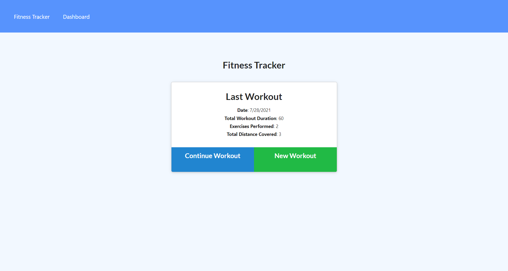
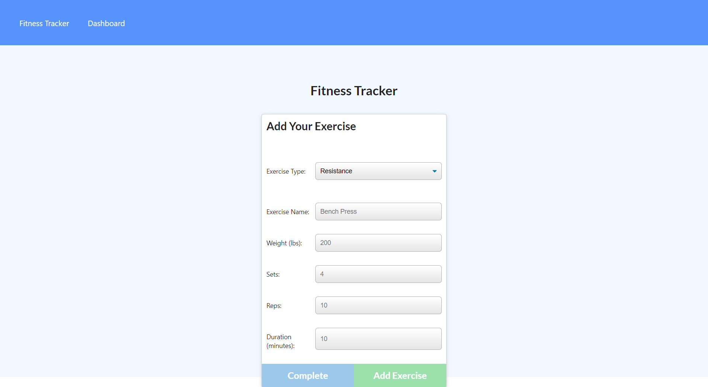
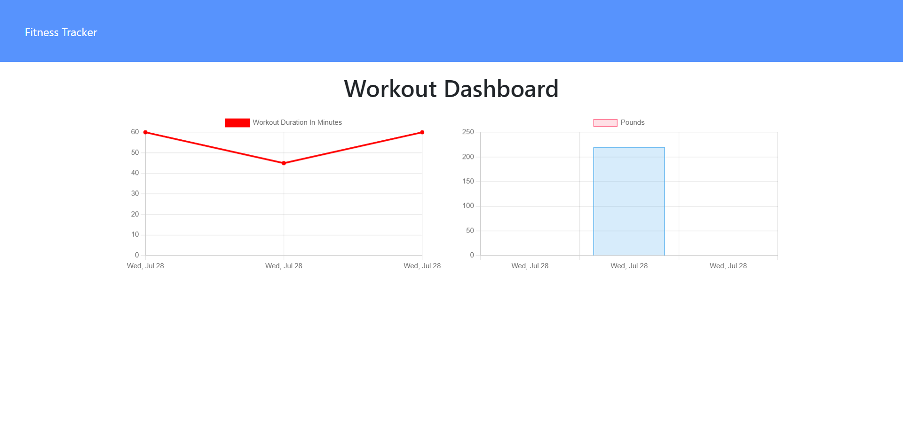

# Workout Tracker

## Contributers
* Chris Whalen, Github: **[CobaltFrostfish](https://github.com/CobaltFrostfish)**

## Links
* **[Repository](https://github.com/CobaltFrostfish/workout-tracker)**
* **[Live App](https://morning-harbor-23287.herokuapp.com/?id=6101c5f8eebe78001587a3af)**
# 

## The project
Do you ever go to the gym and have a hard time remembering what body parts you worked out last time? Are you trying to get into a steady workout routine and need a method of keeping track of all your workouts? Welcome to the Worout Tracker! Here is a simple app where you can add your workouts and save them in order to view them at a later time. The app even includes a dashboard that shows you how your works trend. So hit the gym and give the Workout Tracker a try!

## Technologies applied
* JavaScript
* NodeJS
* Express
* Mongo DB
* NOSQL
* CSS
* MyBrain

## The final production:

